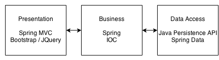

spring-mvc-jpa-templates-TT207
==============================

Spring MVC + JPA templates for Telosys Tools v2.0.7

Description
----------

These templates generates J2EE web application based on Spring MVC, Spring IOC, Spring Data and JPA.
Bootstrap v3 and JQuery are used in front-end pages for reponsive design and navigators compatibility.

The main objective is to respect the guidelines and the best practices in J2EE Web applications development.

For that, unit and integration tests are generated. The integration tests can used in-memory Sql database or a real testing database.

The application manages each entity with CRUD (Create, Read, Update, Delete) operations.

Architecture
---

Presentation layer: 
- Spring MVC, JSPX Pages, Jquery, Bootstrap

Business logic layer: 
- Services injected by Spring IOC

Database Access Objects layer: 
- Java Persistance API, Spring Data

Tutorial
---

- [HOWTO](doc/HOWTO.md)
